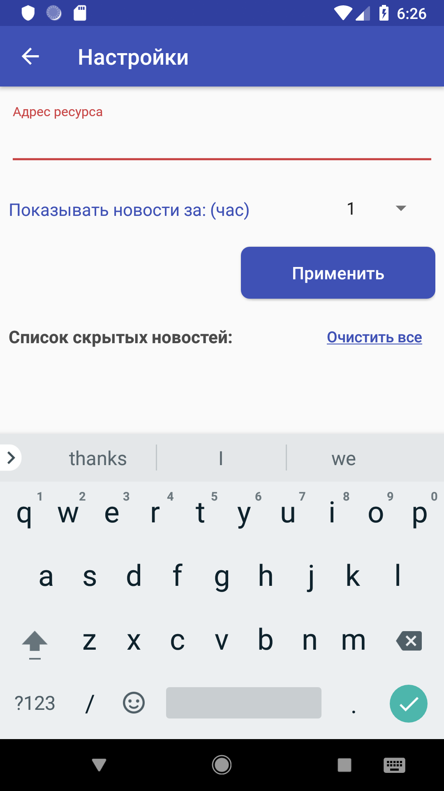
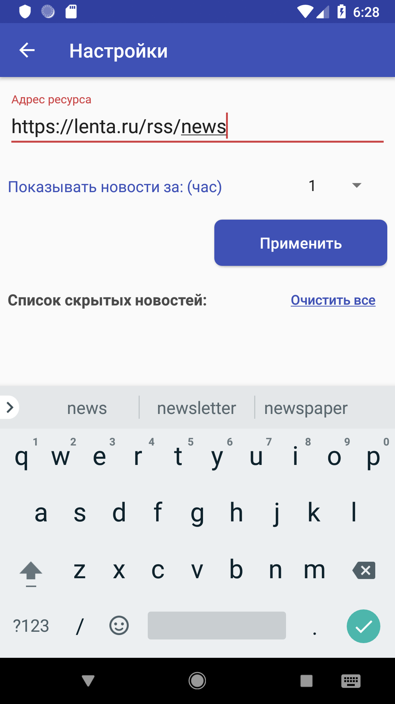
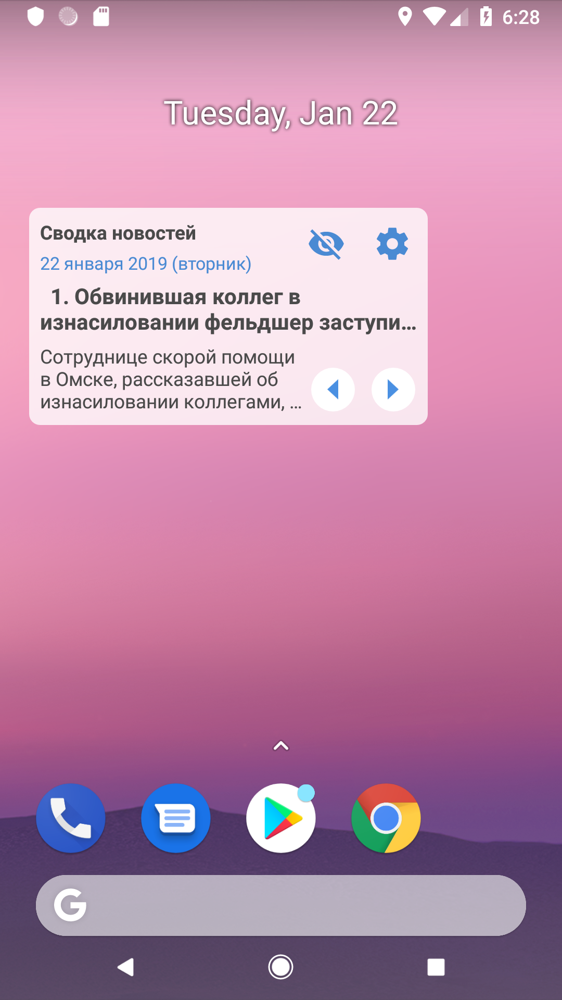
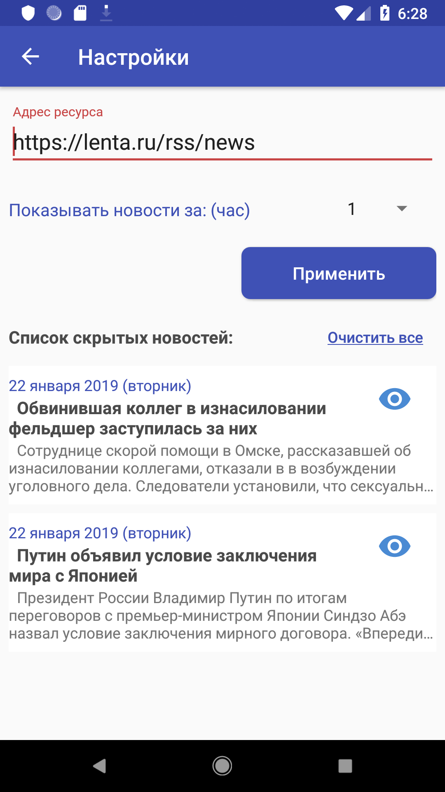

# RssWidgetAndroid

RSS читалка. Должен удовлетворять следующим условиям:
1) У виджета должны быть настройки, внутри которых есть поле ввода для адреса RSS-ленты и список заблокированных новостей с возможностью их реабилитации;
2) На виджете отображается заголовок и текст новости;
3) На виджете имеется три кнопки: влево, вправо и «Не интересно». Они позволяют переходить на следующую и предыдущую новости и убирать из отображения неинтересные для пользователя;
4) Каждую минуту виджет производит автоматическую синхронизацию RSS ленты и обновляет данные (даже если экран выключен и девайс спит);
5) Хороший UX и креативыные дополнения приветствуются.
6) При разработке виджета не следует использовать сторонние библиотеки, кроме google-support."

## Widget screenshots

